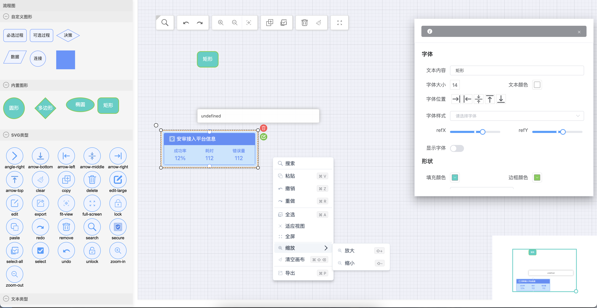

------

| feat     | 提交新功能                                                      |
| -------- | ------------------------------------------------------------- |
| fix      | 修复了 bug                                                     |
| docs     | 只修改了文档                                                    |
| style    | 调整代码格式,未修改代码逻辑(比如修改空格、格式化、缺少分号等)           |
| refactor | 代码重构、既没修复如 bug 也没有添加新功能                           |
| perf     | 性能优化，提高使能的代码更改                                       |
| test     | 添加或修改代码测试                                               |
| chore    | 对构建流程或辅助工具和依赖库(如文档生成等)的更改                      |
| cli      | 脚手架的调整与修改                                               |
| feat   | 新功能（feature）                                                 |  

#### 技术栈

```
@antv/x6 @2.18
vuejs @2.7
vite @4.5
tailwindcss
composition-api
element-ui
```

##### 完成开发

- [x] Toolbar应用
  - [x] 节点搜索
  - [ ] 查询定位移动动画
  - [x] 撤销/重做
  - [x] 放大/缩小
  - [x] 全选/粘贴
  - [x] 删除/清理画布
  - [x] 全屏/适应画布

- [x] 插件应用
  - [x] dnd
  - [x] minimap
  - [x] stencil

- [x] 插件系统
  - [x] clipboard
  - [x] history
  - [x] keyboard
  - [x] scroller
  - [x] selection
  - [x] snapline
  - [x] transform

- [x] 节点类型
  - [x] svg 节点
  - [x] 自定义形状节点
  - [x] 普通内置节点
  - [x] 组节点
  - [ ] 文本节点（提供文字描述）

- [ ] 右键菜单
  - [x] 普通节点
  - [x] 容器/组节点
  - [x] svg图标节点
  - [ ] 边节点
  - [ ] 端/锚点

- [x] 节点属性修改
  - [x] 普通节点（文字、形状、背景色等）
  - [x] svg节点（文字、更换 svg、形状、背景色等）
  - [x] 组节点（文字、背景色等）

- [x] 边节点修改
  - [ ] 边动画
  - [ ] 边属性修改
  - [ ] 边路由
  - [ ] 贝塞尔曲线
	  
- [x] 节点Tools
  - [x] 删除按钮
  - [x] 编辑按钮
  - [ ] 容器组解构按钮

- [x] 自定义节点组件
  - [x] vue 组件（适用于三方插件）
  - [x] html组件（适用tooltip提示）

  


